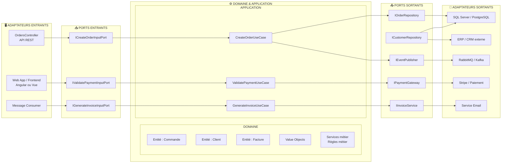

# Architecture Hexagonale – Application d'entreprise .NET

Schéma d'architecture **Ports & Adapters** pour une application de gestion des commandes, clients, produits et factures.

Ce projet implémente cette architecture : **Hexagonal.Domain**, **Hexagonal.Application**, **Hexagonal.Infrastructure**, **Hexagonal.API**. Les contrôleurs (Customers, Orders, Products, Invoices) sont les adaptateurs entrants ; EF Core et les repositories sont les adaptateurs sortants.

## Principe des dépendances

- **Dépendances orientées vers le centre** : les adaptateurs et ports dépendent du domaine / application, jamais l'inverse.
- **Domaine et Application** : au centre (cœur métier), sans dépendance vers l'infrastructure.

---

## Diagramme Mermaid

---

## Légende

| Zone | Rôle |
|------|------|
| **Domaine** | Entités, Value Objects, services et règles métier. Aucune dépendance externe. |
| **Application** | Cas d'usage (use cases) qui orchestrent le domaine. |
| **Ports entrants** | Interfaces appelées par les adaptateurs pour déclencher les cas d'usage. |
| **Ports sortants** | Interfaces implémentées par les adaptateurs (repositories, gateways, events). |
| **Adaptateurs entrants** | Contrôleurs, UI, consumers : traduisent les requêtes en appels aux ports. |
| **Adaptateurs sortants** | Implémentations concrètes (BDD, API, email, broker). |

---
